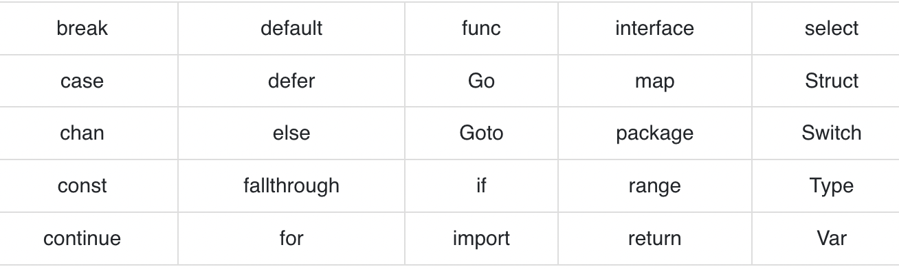

# Go Programming Tutorial

<h2> 1. Introduction to Go Programming </h2>

- What is Go?

  - Simple but fast, popular programming language for cloud engineering
  - statically typed, compiled programming language
  - Developed by google in 2007
  - Open sourced in 2009
  - Often known as golang
  - Syntax has similarity with C,C++
  - Mainly used as a server side or backend language
  - Supports cross-os

- Why Go?

  - For making simple, reliable and efficient computer program/software
  - Helps to create high performance applications but use less resources
  - It helps to write concurrent multithread programs

- Prerequisities

  - Nothing, but knowing C/C++ or any programming language is an advantage

<h2> 2. Go Program structure </h2>

- package declaration - every go program is consist of packages. it is a mandatory thing. it has to be the first statement of go program.
- import packages
- function
- statement

```go
  // main.go
  package main

  import “fmt”

  func main() {

    fmt.Println(“My name is Anisul Islam”)

  }

  output: My name is Anisul Islam

```

<h2> 3. Environment setup </h2>

- IDE / Text Editor -> Any text editor- notepad / notepad++ / VSCode (free), Vim (free) / GoLand (paid)
- Go compiler -> compiler translate the source code into machine/executable code so that machine can understand the instructions
- go extension for VSCode

<h2> 4. First Go Program </h2>

- A simple go program

  ```go
  // filename: main.go
  // a program for printing student details
  package main

  import "fmt"

  func main() {
    fmt.Println("Anisul Islam is a student")
    fmt.Println("Anisul Islam is 32 years old")
    fmt.Println("Anisul Islam has got GPA 3.92/5 in SSC")
    fmt.Print("Anisul Islam originally from Bangladesh");
  }


  ```

- running the program
  - go mod init project-name
  - go run fileName.go

<h2> 5. Tokens - Escape sequences & comments </h2>

- Token of any programming language

  - keywords
  - data types
  - variables
  - Escapse sequences
  - operators

- escape sequences example

  ```go
    package main
    import "fmt"
    func main(){
      fmt.Print("Name \t Age\n")
      fmt.Print("----- \t ------\n")
      fmt.Print("Anis \t 32\n")
      fmt.Print("Rakib \t 29\n")
    }
  ```

- there are 2 types of comment is available in Go -> single line, multiple line comment. comments are ignored by the compiler.
  ```go
    // single line comment
    /*
      multiple
      line
      comment
    */
  ```

<h2> 6. Keywords & Data types </h2>

- keywords: keywords are reserved words.
  
- Data types: boolean, string, numeric - integer, floating, derived types - pointer, array, structure, slice, map, interface etc.
- example of data types

  ```go
    "anisul islam" -> string type
    21 -> int type
    21.5 -> floating type
    true/false -> bool

    // more on int, float
    variation of integer-> int8 (8 bits), int16, int32, int64, uint8 (only positive 0 to 255), uint6, uint32, uint64

    variation of float-> float32, float64
  ```

<h2> 7. Variables </h2>

- syntax of variable declaration: var variable1, variable2, ... variableN dataType
- variable naming convention (camelcasing)
- example

  ```go
    package main
    import "fmt"
    func main(){
      // static variable declaration
      var name, country string
      var age int
      var gpa float32

      // variable initialization
      name = "anisul islam"
      country = "Bangladesh"
      age = 32
      gpa = 3.92

      // dynamic variable declaration + initialization
     //  var name = "Anisul Islam"
     //  var country = "Bangladesh"
     //  var age = 32
     //  var gpa = 3.92

     // var name,country,age,gpa = "anisul islam", "Bangladesh", 32, 3.92

     // shortcuts
     // name := "Anisul Islam"
     // country := "Bangladesh"
     // age := 32
     // gpa := 3.92

      fmt.Println(name)
      fmt.Println(name, " is a student")
      fmt.Println(name,"is", age, "years old")
      fmt.Println(name, "has got" , gpa, "/5 in SSC")
      fmt.Print(name,"originally from ", country);
    }


  ```

<h2> 8. Formatting output</h2>

```go

 package main
 import "fmt"
 func main(){
    name := "Anisul Islam"
    country := "Bangladesh"
    age := 32
    gpa := 3.92

    fmt.Printf("%v is a student\n", name)
    fmt.Printf("%v is %v years old\n", name, age)
    fmt.Printf("%v has got GPA %v/5 in SSC\n", name, gpa)
    fmt.Printf("%v originally from %v\n", name, country);
 }
```

<h2> 9. Constants && Getting User Input </h2>

- Constants indicate to fix values

  ```go

    package main
    import "fmt"
    func main(){
      var name string
     	const COUNTRY = "Bangladesh"
     	var age, num1, num2 int
     	var gpa float32

  		fmt.Printf("Enter your name: ")
  		fmt.Scanf("%v", &name)

  		fmt.Printf("Enter your age: ")
  		fmt.Scan(&age)

  		fmt.Printf("Enter your SSC gpa: ")
  		fmt.Scanln(&gpa)

  		fmt.Printf("Enter 2 numbers: ")
  		fmt.Scan(&num1, &num2)

      fmt.Printf("%v is a student\n", name)
      fmt.Printf("%v is %v years old\n", name, age)
      fmt.Printf("%v has got GPA %v/5 in SSC\n", name, gpa)
      fmt.Printf("%v originally from %v\n", name, COUNTRY);
      fmt.Printf("num1 = %v, num2 = %v\n", num1, num2);
    }
  ```

<h2> 10. Number conversion calculator & number formatting</h2>

```go
    package main

    import "fmt"
    func main(){


      // string formatting
      // var name = "Anisul Islam"
      // fmt.Printf("%s\n",name)
      // fmt.Printf("%q\n",name)

        // floating number formatting
      // var number = 3.1416
      // fmt.Printf("%.2f\n",number)

      var decimalNumber int

      fmt.Printf("decimal number= ")
      fmt.Scanf("%v", &decimalNumber)

      fmt.Printf("Binary Number = %b\n",decimalNumber)
      fmt.Printf("Octal Number = %o\n",decimalNumber)
      fmt.Printf("Hexa Number = %x\n",decimalNumber)

    }

```

<h2> 11. Operators </h2>

- operator - symbol for doing calculation
- Types of operators

  - Arithmetic Operators -> +, -, \*, /, %
  - Assignment Operators -> =, +=, -=, \*=, /=, %=
  - Unary Operators -> ++, --
  - Relational Operators
  - Logical operators -> &&, ||, !
  - Bitwise operators -> &, |, ^
  - others -> , (comma), & (returns address), \* (pointer)

- example of Arithmetic operator

  ```go
    package main
    import "fmt"
    func main(){
      // arithmetic operator -> +, -, *, /, %
      var num1, num2 int
      fmt.Printf("num1= ");
      fmt.Scan(&num1)
      fmt.Printf("num2= ");
      fmt.Scan(&num2)

      result := num1 + num2
      fmt.Printf("%v+%v=%v\n", num1, num2, result)

      result = num1 - num2
      fmt.Printf("%v-%v=%v\n", num1, num2, result)

      result = num1 * num2
      fmt.Printf("%v*%v=%v\n", num1, num2, result)

      var result2 =  float32(num1) / float32(num2)
      fmt.Printf("%v/%v=%v\n", num1, num2, result2)

      result = num1 % num2
      fmt.Printf("%v%%%v=%v\n", num1, num2, result)
    }
  ```

<h2> 12. Find the area of triangle and circle </h2>

```go
    package main

    import "fmt"
    func main(){

      var radius, area float32

      fmt.Printf("Enter Radius : ")
      fmt.Scan(&radius)

      area = 3.1416 * radius * radius
      fmt.Printf("Area of circle: %v\n",area)

      // a program to calculate area of triangle
      // var base, height, area float32

      // fmt.Printf("Base = ")
      // fmt.Scan(&base)

      // fmt.Printf("Height = ")
      // fmt.Scan(&height)

      // area = 0.5 * base * height

      // fmt.Printf("Area of triangle = %v\n", area)
    }

```

  <h2> 13. Assignment Operator </h2>

```go
    package main

    import "fmt"
    func main(){

        // 2. Assignment Operators -> =, +=, -=, *=, /=, %=

        x := 4

        x = x + 1
        x+=1 // x = x + 1
        x-=1 // x = x - 1
        x*=1 // x = x * 1
        x/=1 // x = x / 1
        x%=1 // x = x % 1

        fmt.Printf("x = %v\n",x)
      }

```

  <h2> 14. Unary Operator </h2>
  <h2> 15. Relational Operator </h2>
  <h2> 16. Logical Operator </h2>
  <h2> 17. Bitwise Operator </h2>

```go
    package main

    import "fmt"
    func main(){

      x := 18      // 18 = 10010
      y := 17      // 17 = 10001
      and := x & y   //16  = 10000
      or := x | y   //19  = 10011
      exor := x ^ y   //3  = 00011
      fmt.Printf("x & y = %v\n",and)
      fmt.Printf("x | y = %v\n",or)
      fmt.Printf("x ^ y = %v\n",exor)

    }

```

<h2> 18. if, else if, else control statement </h2>

```go
      // with if only
      package main

      import "fmt"
      func main(){
        // a program to determine positive / negative / zero
        number := 10
        if number > 0 {
          fmt.Printf("Positive\n")
        }
        if number < 0 {
          fmt.Printf("Negative\n")
        }
        if number == 0 {
          fmt.Printf("Zero\n")
        }
      }

      // with if, else if
      package main

      import "fmt"
      func main(){
        // a program to determine positive / negative / zero
        number := 10
        if number > 0 {
          fmt.Printf("Positive\n")
        }	else if number < 0 {
          fmt.Printf("Negative\n")
        } else if number == 0 {
          fmt.Printf("Zero\n")
        }
      }

      // with if, else if, else
      package main

      import "fmt"
      func main(){
        // a program to determine positive / negative / zero
        number := 10
        if number > 0 {
          fmt.Printf("Positive\n")
        }	else if number < 0 {
          fmt.Printf("Negative\n")
        } else {
          fmt.Printf("Zero\n")
        }
      }
```

<h2> 19. A Go program to determine whether a number is even/odd </h2>

```go
    // a go program to determine even/odd
  package main

  import "fmt"
  func main(){
    var number int
    fmt.Printf("Enter any integer: ")
    fmt.Scanf("%v",&number)

    if number % 2 == 0 {
      fmt.Printf("Even\n")
    }	else {
      fmt.Printf("Odd\n")
    }
  }
```

<h2> 20. A Go program to find largest number among 3 numbers using relational operators </h2>

```go
package main

import "fmt"
func main(){
	var number1, number2, number3 int
	fmt.Printf("Enter 3 numbers: ")
	fmt.Scanf("%v %v %v",&number1, &number2, &number3)

	if number1 > number2 {
		if number1 > number3 {
			fmt.Printf("%v is the largest number\n", number1)
		}else{
			fmt.Printf("%v is the largest number\n", number3)
		}
	}	else if number2 > number1 {
		if number2 > number3 {
			fmt.Printf("%v is the largest number\n", number2)
		}else{
			fmt.Printf("%v is the largest number\n", number3)
		}
	}	else {
		fmt.Printf("Numbers are equal\n")
	}
}
```

<h2> 21. A Go program to find largest number among 3 numbers using Logical operators </h2>

```go
package main

import "fmt"
func main(){
	var number1, number2, number3 int
	fmt.Printf("Enter 3 numbers: ")
	fmt.Scanf("%v %v %v",&number1, &number2, &number3)

	if (number1 > number2) && (number1 > number3){
			fmt.Printf("%v is the largest number\n", number1)
	}	else if (number2 > number1) && (number2 > number3){
			fmt.Printf("%v is the largest number\n", number2)
	}	else if (number3 > number1) && (number3 > number2){
			fmt.Printf("%v is the largest number\n", number3)
	}	else {
		fmt.Printf("Numbers are equal\n")
	}
}
```

<h2> 22. A Go program to spell digits </h2>

```go
  // a go program to spell digits with if, else if, else
package main

import "fmt"
func main(){
	var digit int
	fmt.Printf("Enter a digit (0-9): ")
	fmt.Scanf("%v",&digit)

	if (digit == 0){
			fmt.Printf("Zero\n")
	}	else if (digit == 1){
			fmt.Printf("One\n")
	}	else if (digit == 2){
			fmt.Printf("Two\n")
	}	else if (digit == 3){
			fmt.Printf("Three\n")
	}	else if (digit == 4){
			fmt.Printf("Four\n")
	}	else if (digit == 5){
			fmt.Printf("Five\n")
	}	else if (digit == 6){
			fmt.Printf("Six\n")
	}	else if (digit == 7){
			fmt.Printf("Seven\n")
	}	else if (digit == 8){
			fmt.Printf("Eight\n")
	}	else if (digit == 9){
			fmt.Printf("Nine\n")
	}	else {
		fmt.Printf("Not a digit\n")
	}
}
```

<h2> 23. switch control statement </h2>
- same as c, c++, java, js but only difference you do not use break statement. only run the mateched statement

```go
  // a go program to spell digits with switch statement
package main

import "fmt"
func main(){
	var digit int
	fmt.Printf("Enter a digit (0-9): ")
	fmt.Scanf("%v",&digit)

	switch digit {
	case 0:
		fmt.Printf("Zero\n")
	case 1:
		fmt.Printf("One\n")
	case 2:
		fmt.Printf("Two\n")
	case 3:
		fmt.Printf("Three\n")
	case 4:
		fmt.Printf("Four\n")
	case 5:
		fmt.Printf("Five\n")
	case 6:
		fmt.Printf("Six\n")
	case 7:
		fmt.Printf("Seven\n")
	case 8:
		fmt.Printf("Eight\n")
	case 9:
		fmt.Printf("Nine\n")

  // multiple cases possible
  // case 0,1,2,3,4:
  //   fmt.Printf("less than 5" )
	default:
		fmt.Printf("Not a digit\n")
	}

}

```

<h2> 24. Loop control statement </h2>

- in go we have only 1 loop which is for loop; can take form of while loop as weell
- it helps us to execute some statements again and again

<h2> 25. Series related programs </h2>

```go
    package main

    import "fmt"
    func main(){

        // series -> 2 + 4 + 6 + 8 + ... N
        var startNumber, endNumber int

        fmt.Printf("Enter the starting number of series: ")
        fmt.Scan(&startNumber)

        fmt.Printf("Enter the last number of series: ")
        fmt.Scan(&endNumber)

        sum := 0
        for i := startNumber; i <= endNumber; i=i+2 {
          sum = sum + i
        }
        fmt.Printf("sum = %v\n",sum)

}

```

<h2> 26. break and continue statement </h2>

```go

  package main

import "fmt"
func main(){

	// break, continue statement

	for i := 1; i <= 10; i++ {
		if i%2 == 0 {
			continue
		}
		fmt.Printf("%v\n",i)
	}
	for i := 1; i <= 10; i++ {
		if i%2 == 0 {
			break
		}
		fmt.Printf("%v\n",i)
	}

}

```

<h2> 27. Functions </h2>

```go
 package main

  import "fmt"

  func square (number int) int{
    return number * number
  }

  func displayMessage(country string){
    fmt.Printf("I love my motherland: %v\n", country)
  }

  func main(){
    displayMessage("Bangladesh")
    displayMessage("India")
    fmt.Printf("Square of 6 = %v\n",square(6))
    fmt.Printf("Square of 7 = %v\n",square(7))
  }
```

<h2> 28. create a function for calculator </h2>

```go
    package main

    import "fmt"

    func add(x, y float32) float32{
      return x + y
    }
    func sub(x, y float32) float32{
      return x - y
    }
    func mul(x, y float32) float32{
      return x * y
    }
    func div(x, y float32) float32{
      return x / y
    }

    func main(){
      var num1, num2, result float32
      var option string

      i:=true
      for  i==true {
        fmt.Printf("num1 = ")
        fmt.Scan(&num1)

        fmt.Printf("num2 = ")
        fmt.Scan(&num2)

        fmt.Printf("choose an option ( + - * / ) : ")
        fmt.Scan(&option)

        switch option {
          case "+":
            result = add(num1, num2)
          case "-":
            result = sub(num1, num2)
          case "*":
            result = mul(num1, num2)
          case "/":
            result = div(num1, num2)
          default:
            fmt.Println("Invalid option")
            continue;
        }
        fmt.Printf("Result = %v\n",result)
      }
    }
```

<h2> 29. Pointers </h2>

- dereferencing operator
- A pointer is a variable whose value is the address of another variable, declaration: var varName \*varType

  ```go
  package main

  import "fmt"

  func change (val int) {
    val = 8
  }

  func changeWihPointer (val *int) {
    *val = 8
  }

  func main(){
    x:=10
    change(x)
    fmt.Println(x)

    // call by reference
    changeWihPointer(&x)
    fmt.Println(x)
  }
  ```

<h2> 30.Structure </h2>
- class is not supported here but we can use structs

- example

  ```go
      package main

      import "fmt"

       type Student struct{
          name string
          age int
          id int
        }


      func main(){

         <!-- type Student struct{
          name string
          age int
          id int
        } -->

        rahim := Student{"Anisul", 32,1302020017}
        rahim.age = 30
        fmt.Println(rahim)
        fmt.Println(rahim.id)
        fmt.Println(rahim.name)
        fmt.Println(rahim.age)
      }

      // passing struct in a function
      package main

      import "fmt"

      type Student struct {
        name string
        age int
        id int
      }

      func displayInfo(s Student) {
        fmt.Println(s.name)
        fmt.Println(s.age)
      }
      func main() {
        s1 := Student{"Anisul", 32, 1302020017}
        displayInfo(s1)
      }

      // if we need to change data
      package main

      import "fmt"

      type Student struct {
        name string
        age int
        id int
      }

      func (x *Student) increaseAge(val int) {
        x.age += val
      }

      func main() {
        s1 := Student{"Anisul Islam", 32}
        s1.increaseAge(1)
        fmt.Println(s1.age)
      }

      // timer app
      // Employee management app
  ```

<h2> 31. Arrays & slices data types </h2>

- array is fixed in Go
- var arrayName[size] dataType
- only the same data type in one array
- var array_name = [length]datatype{values} // here length is defined
- array index starts with 0
- what if we dont know the size of array then we will use slice; allows us to use dynamic size
- append(sliceName, sliceNewValue)

```

```

```

```
